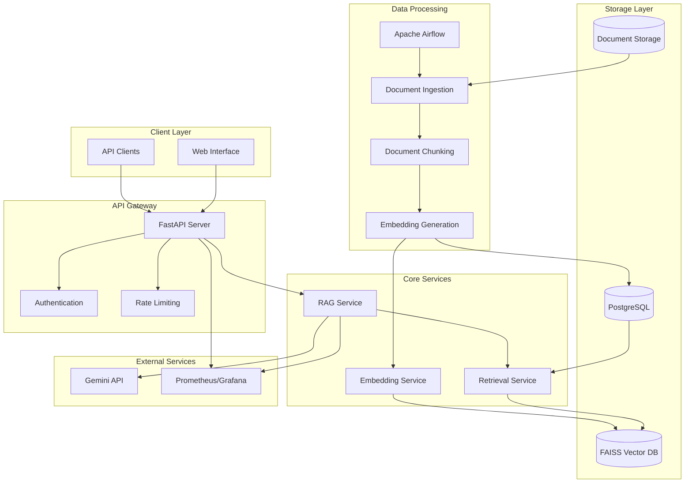

# RAG Enterprise Assistant

A containerized RAG (Retrieval-Augmented Generation) based enterprise assistant system that leverages Gemini API for language model capabilities, LlamaIndex for document processing and retrieval, FAISS for vector storage, and Apache Airflow for orchestrating automated document ingestion pipelines.

## Features

- **Automated Document Ingestion**: Apache Airflow orchestrates document processing pipelines
- **High-Performance Vector Search**: FAISS provides fast similarity search capabilities  
- **Enterprise-Grade API**: FastAPI with authentication, rate limiting, and monitoring
- **Scalable Architecture**: Containerized microservices with horizontal scaling support
- **Comprehensive Monitoring**: Structured logging, metrics, and health checks
- **Security**: JWT authentication, data encryption, and PII detection

## Project Structure

```
rag-enterprise-assistant/
├── src/                    # Source code
│   ├── api/               # FastAPI application and endpoints
│   ├── services/          # Business logic services
│   ├── models/            # Data models and schemas
│   └── utils/             # Utility functions
├── config/                # Configuration management
├── tests/                 # Test suites
│   ├── unit/             # Unit tests
│   └── integration/      # Integration tests
├── docker/               # Docker configuration files
├── docs/                 # Documentation
├── requirements.txt      # Python dependencies
└── .env.example         # Environment variables template
```

## Architecture



## Quick Start

### Prerequisites

- Python 3.11+
- Docker and Docker Compose
- PostgreSQL (for metadata storage)
- Gemini API key

### Installation

1. Clone the repository:
```bash
git clone <repository-url>
cd rag-enterprise-assistant
```

2. Create and activate a virtual environment:
```bash
python -m venv venv
source venv/bin/activate  # On Windows: venv\Scripts\activate
```

3. Install dependencies:
```bash
pip install -r requirements.txt
```

4. Set up environment variables:
```bash
cp .env.example .env
# Edit .env with your configuration values
```

5. Initialize the database and vector store:
```bash
# Database setup commands will be added in subsequent tasks
```

### Configuration

The application uses environment variables for configuration. Copy `.env.example` to `.env` and update the values:

- `GEMINI_API_KEY`: Your Google Gemini API key
- `DB_PASSWORD`: PostgreSQL database password  
- `SECRET_KEY`: JWT secret key for authentication
- Other settings as needed for your environment

## Development

### Running Tests

```bash
# Run all tests
pytest

# Run with coverage
pytest --cov=src

# Run specific test types
pytest tests/unit/
pytest tests/integration/
```

### Code Quality

```bash
# Format code
black src/ tests/

# Lint code  
flake8 src/ tests/

# Type checking
mypy src/
```

## Architecture

The system follows a microservices architecture with the following components:

- **API Gateway**: FastAPI server handling client requests
- **RAG Service**: Core business logic for query processing
- **Document Ingestion**: Airflow DAGs for automated document processing
- **Vector Storage**: FAISS for similarity search
- **Metadata Storage**: PostgreSQL for document metadata
- **Monitoring**: Prometheus metrics and structured logging

## Contributing

1. Fork the repository
2. Create a feature branch
3. Make your changes
4. Add tests for new functionality
5. Ensure all tests pass
6. Submit a pull request

## License

[License information to be added]