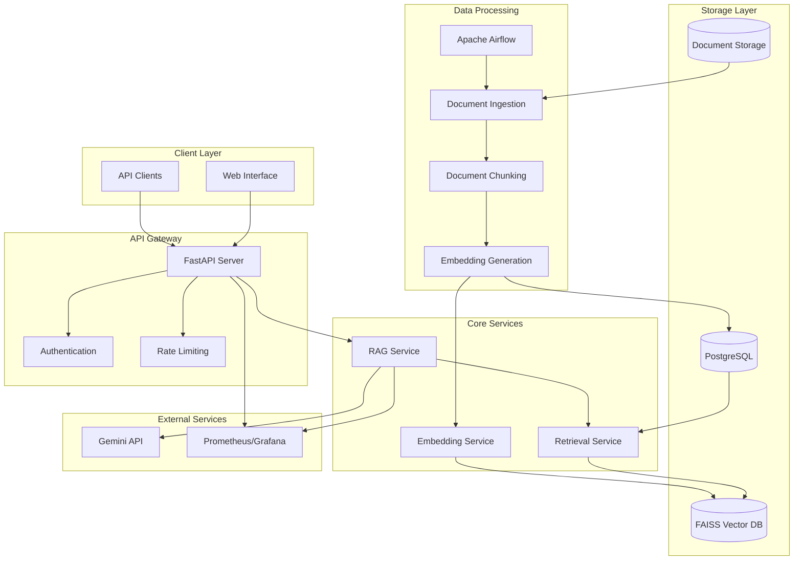

# Design Document

## Overview

The RAG Enterprise Assistant is a containerized system that provides intelligent document retrieval and question-answering capabilities for enterprise environments. The system combines modern RAG (Retrieval-Augmented Generation) techniques with robust orchestration and scalable architecture patterns.

The core architecture follows a microservices pattern with the following key components:
- **Document Ingestion Pipeline**: Apache Airflow orchestrates automated document processing
- **Vector Storage**: FAISS provides high-performance similarity search capabilities
- **Language Model Integration**: Gemini API handles natural language understanding and generation
- **API Gateway**: FastAPI serves as the primary interface for client interactions
- **Monitoring Stack**: Comprehensive observability through structured logging and metrics

## Architecture



## Components and Interfaces

### 1. API Gateway (FastAPI)

**Purpose**: Primary entry point for all client requests with authentication, rate limiting, and request routing.

**Key Interfaces**:
- `POST /api/v1/query` - Submit natural language queries
- `GET /api/v1/health` - Health check endpoint
- `POST /api/v1/documents/upload` - Manual document upload
- `GET /api/v1/documents/{doc_id}/status` - Check document processing status

**Implementation Details**:
- Uses Pydantic models for request/response validation
- Implements JWT-based authentication
- Includes middleware for CORS, logging, and metrics collection
- Supports async request handling for improved performance

### 2. RAG Service

**Purpose**: Core business logic that orchestrates document retrieval and response generation.

**Key Methods**:
```python
class RAGService:
    async def process_query(self, query: str, context_limit: int = 5) -> RAGResponse
    async def retrieve_relevant_chunks(self, query: str) -> List[DocumentChunk]
    async def generate_response(self, query: str, context: List[DocumentChunk]) -> str
```

**Integration Points**:
- Retrieval Service for document similarity search
- Gemini API for response generation
- Metadata database for document provenance

### 3. Document Ingestion Pipeline (Apache Airflow)

**Purpose**: Automated processing of documents from ingestion to vector storage.

**DAG Structure**:
```python
document_ingestion_dag = DAG(
    'document_ingestion',
    schedule_interval='@hourly',
    tasks=[
        'scan_input_directory',
        'validate_documents',
        'chunk_documents',
        'generate_embeddings',
        'store_vectors',
        'update_metadata',
        'cleanup_processed_files'
    ]
)
```

**Processing Steps**:
1. **Document Scanning**: Monitor input directories for new files
2. **Validation**: Check file formats and extract text content
3. **Chunking**: Use LlamaIndex to split documents into semantic chunks
4. **Embedding Generation**: Create vector representations using embedding models
5. **Vector Storage**: Store embeddings in FAISS with metadata indexing
6. **Cleanup**: Archive processed documents and update status

### 4. Vector Storage (FAISS)

**Purpose**: High-performance similarity search for document retrieval.

**Configuration**:
- Index Type: HNSW (Hierarchical Navigable Small World) for balanced speed/accuracy
- Embedding Dimension: 768 (compatible with sentence-transformers)
- Distance Metric: Cosine similarity
- Persistence: Regular snapshots to disk with incremental updates

**Operations**:
- `add_vectors(embeddings, metadata)` - Add new document embeddings
- `search(query_vector, k=10)` - Retrieve top-k similar documents
- `update_index()` - Rebuild index for optimal performance
- `create_snapshot()` - Persist index state

## Data Models

### Document Chunk
```python
@dataclass
class DocumentChunk:
    chunk_id: str
    document_id: str
    content: str
    metadata: Dict[str, Any]
    embedding: Optional[List[float]]
    created_at: datetime
    chunk_index: int
    token_count: int
```

### RAG Response
```python
@dataclass
class RAGResponse:
    query: str
    answer: str
    source_chunks: List[DocumentChunk]
    confidence_score: float
    processing_time_ms: int
    token_usage: TokenUsage
```

### Document Metadata
```python
@dataclass
class DocumentMetadata:
    document_id: str
    filename: str
    file_type: str
    file_size: int
    upload_timestamp: datetime
    processing_status: ProcessingStatus
    chunk_count: int
    tags: List[str]
```

## Error Handling

### API Layer Error Handling
- **400 Bad Request**: Invalid query format or missing parameters
- **401 Unauthorized**: Invalid or missing authentication tokens
- **429 Too Many Requests**: Rate limit exceeded
- **500 Internal Server Error**: Unexpected system errors
- **503 Service Unavailable**: Downstream service failures

### Pipeline Error Handling
- **Document Processing Failures**: Retry with exponential backoff, dead letter queue for persistent failures
- **Embedding Generation Errors**: Fallback to alternative embedding models
- **Vector Storage Failures**: Automatic failover to backup FAISS instances
- **External API Failures**: Circuit breaker pattern for Gemini API calls

### Monitoring and Alerting
- Structured logging with correlation IDs across all services
- Custom metrics for query latency, embedding generation time, and API response codes
- Automated alerts for error rate thresholds and service availability

## Testing Strategy

### Unit Testing
- **Service Layer**: Mock external dependencies (Gemini API, FAISS)
- **Data Models**: Validation logic and serialization/deserialization
- **Utility Functions**: Document chunking, text preprocessing, embedding utilities
- **Coverage Target**: 90% code coverage with focus on critical paths

### Integration Testing
- **API Endpoints**: End-to-end request/response validation
- **Database Operations**: FAISS index operations and metadata persistence
- **Pipeline Testing**: Airflow DAG execution with test documents
- **External Service Integration**: Gemini API integration with test queries

### Performance Testing
- **Load Testing**: API throughput under concurrent requests
- **Vector Search Performance**: FAISS query latency with varying corpus sizes
- **Memory Usage**: Embedding storage and retrieval memory profiles
- **Scalability Testing**: Horizontal scaling behavior under load

### Security Testing
- **Authentication Testing**: JWT token validation and expiration
- **Input Validation**: SQL injection, XSS, and malicious file upload prevention
- **Data Encryption**: At-rest and in-transit encryption verification
- **Access Control**: Role-based permissions and API endpoint security

## Deployment Architecture

### Container Strategy
- **Multi-stage Docker builds** for optimized image sizes
- **Base images**: Python 3.11-slim for consistency and security
- **Health checks**: Built-in container health monitoring
- **Resource limits**: CPU and memory constraints for predictable performance

### Service Orchestration
- **Docker Compose**: Development and single-node deployments
- **Kubernetes**: Production multi-node deployments with auto-scaling
- **Service Discovery**: Internal DNS resolution between containers
- **Load Balancing**: NGINX reverse proxy for API gateway

### Configuration Management
- **Environment Variables**: Sensitive configuration (API keys, database URLs)
- **Config Files**: Application settings, model parameters, chunking strategies
- **Secrets Management**: Kubernetes secrets or Docker secrets for production
- **Environment Separation**: Development, staging, and production configurations